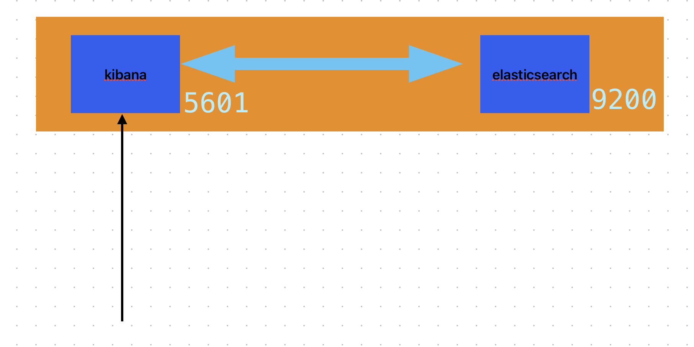
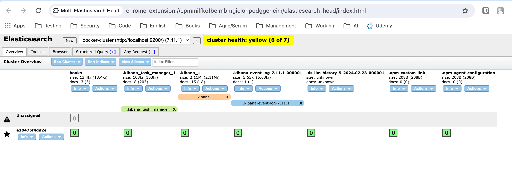

# Some essential links
- Kabana: https://www.elastic.co/kibana
- Kabana docker: https://www.elastic.co/guide/en/kibana/current/docker.html


# Installation:
Docker commands: 
- To run elasticsearch 
```
docker run -p 9200:9200 -p 9300:9300 --name elasticsearch -e "discovery.type=single-node" docker.elastic.co/elasticsearch/elasticsearch:7.11.1
```

- To run Kibana
```
 docker run -p 5601:5601 --name kibana --link elasticsearch:elasticsearch docker.elastic.co/kibana/kibana:7.11.1
 ```


Access to Kibana: http://localhost:5601/app/home#/

- Kibana authentication with SSO: https://www.elastic.co/guide/en/kibana/current/kibana-authentication.html
- Kabana installation: https://www.elastic.co/guide/en/elasticsearch/reference/7.11/docker.html

# Setup Elasticsearch for automation testing report dashboard

- Post data to elasticsearch (Push test cases results of automation test)
- Accessing data from elasticsearch (Read and query)
- Tool:  Chrome Extension -  Elasticsearch Head plugin: 
https://chromewebstore.google.com/detail/multi-elasticsearch-head/cpmmilfkofbeimbmgiclohpodggeheim

## Basic Elasticsearch Setup
- Index pattern in Kibana
  (Create an index, Get an index , Delete an index)
- Discover - Used to view the log in customized format.
- Visualize and create the different visualization based on the requirement.
- Create Chart on Kibana (Pie Chart, Vertical Chart)
- Arrange the chart into Board on Kibana
- Inject data , collect the data to ElasticSearch , visualize data in Kibana.

## Update test case result to Elasticsearch

```agsl
import org.apache.http.HttpHost;
import org.elasticsearch.client.RestClient;
import org.elasticsearch.client.RestHighLevelClient;
import org.elasticsearch.action.index.IndexRequest;
import org.elasticsearch.action.index.IndexResponse;
import org.elasticsearch.common.xcontent.XContentType;

public class PushLogsToElasticsearch {
    public static void main(String[] args) {
        try (RestHighLevelClient client = new RestHighLevelClient(
                RestClient.builder(new HttpHost("localhost", 9200, "http")))) {

            IndexRequest request = new IndexRequest("failed_test_logs");
            request.source("test_case_name", "test_case_1",
                    "log_message", "Test case failed due to assertion error",
                    "timestamp", System.currentTimeMillis());

            IndexResponse response = client.index(request);
            System.out.println("Index created with id: " + response.getId());
        } catch (Exception e) {
            e.printStackTrace();
        }
    }
}

```

# References:
- https://www.youtube.com/watch?v=hfD6otdkCTA&ab_channel=TestingMiniBytes